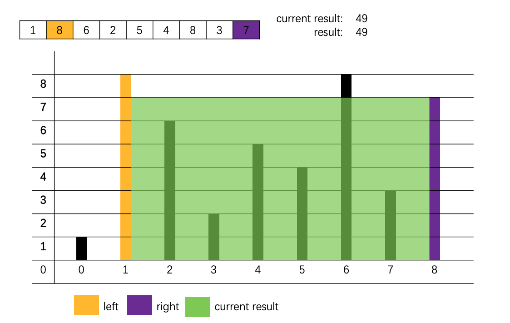

# Container With Most Water
# 盛最多水的容器


## Description
Given n non-negative integers a1, a2, ..., an , where each represents a point at coordinate (i, ai). n vertical lines are drawn such that the two endpoints of line i is at (i, ai) and (i, 0). Find two lines, which together with x-axis forms a container, such that the container contains the most water.

## Description
给你 n 个非负整数 a1，a2，...，an，每个数代表坐标中的一个点 (i, ai) 。在坐标内画 n 条垂直线，垂直线 i 的两个端点分别为 (i, ai) 和 (i, 0)。找出其中的两条线，使得它们与 x 轴共同构成的容器可以容纳最多的水。


## Note
You may not slant the container and n is at least 2.

## 说明
你不能倾斜容器，且 n 的值至少为 2。



## Example
    Input: [1,8,6,2,5,4,8,3,7]
    Output: 49
    


## 样例
### 样例  1:
	输入：[1,8,6,2,5,4,8,3,7]
    输出：49

## Solution

### 双指针
这道题目可以通过双指针来解决, 根据我们可以将初始的左右指针分别设置为数组的开始和结束的位置, 计算当前的结果, 然后将左右指针指向的比较小的指针向中心移动.

### Code

```java
    //T O(n)
    //S O(1)
    public int maxArea(int[] height) {
        //定义左右指针
        int left = 0, right = height.length - 1;

        //返回结果
        int result = 0;

        //遍历数组
        while(left < right){
            //更新结果
            result = Math.max(result,
                    //计算当前结果
                    Math.min(height[left], height[right]) * (right - left) );
            //移动高度较小的指针
            if(height[left] < height[right]){
                left++;
            }else{
                right--;
            }
        }

        return result;
    }
```