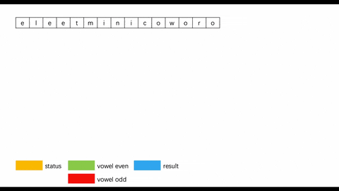
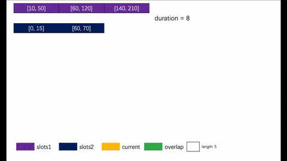

# LeetCodeAllAnimation
Use animation to understand the algorithm.(用动画展示算法)

|Title|LeetCode|LintCode|Animation|Finish|
|--------|:----:|:----:|--------------------|:-:|
|[1371_find-the-longest-substring-containing-vowels-in-even-counts](/1371_find-the-longest-substring-containing-vowels-in-even-counts/code.md)|1371|-||&check;|
|[1300_sum-of-mutated-array-closest-to-target](/1300_sum-of-mutated-array-closest-to-target/code.md)|1300|-||&check;|
|[1246_palindrome-removal](/1246_palindrome-removal/code.md)|1246|-||&check;|
|[1229_meeting-scheduler](/1229_meeting-scheduler/code.md)|1229|-||&check;|
|[1198_find-smallest-common-element-in-all-rows](/1198_find-smallest-common-element-in-all-rows/code.md)|1198|-||&check;|
|[1071_greatest-common-divisor-of-strings](/1071_greatest-common-divisor-of-strings/code.md)|1071|-||&check;|
|[1035_uncrossed-lines](/1035_uncrossed-lines/code.md)|1035|-||&check;|
|[994_rotting-oranges](/994_rotting-oranges/code.md)|994|-||&check;|
|[977_squares-of-a-sorted-array](/977_squares-of-a-sorted-array/code.md)|977|-||&check;|
|[945_minimum-increment-to-make-array-unique](/945_minimum-increment-to-make-array-unique/code.md)|945|-||&check;|
|[929_unique-email-addresses](/929_unique-email-addresses/code.md)|929|-||x|
|[914_x-of-a-kind-in-a-deck-of-cards](/914_x-of-a-kind-in-a-deck-of-cards/code.md)|914|-||&check;|
|[876_middle-of-the-linked-list](/876_middle-of-the-linked-list/code.md)|876|228||&check;|
|[886_possible-bipartition](/886_possible-bipartition/code.md)|886|-||&check;|
|[836_rectangle-overlap](/836_rectangle-overlap/code.md)|836|-||x|
|[820_short-encoding-of-words](/820_short-encoding-of-words/code.md)|820|-||&check;|
|[799_champagne-tower](/799_champagne-tower/code.md)|799|-||&check;|
|[739_daily-temperatures](/739_daily-temperatures/code.md)|739|1060||&check;|
|[733_flood-fill](/733_flood-fill/code.md)|733|1062||&check;|
|[718_maximum-length-of-repeated-subarray](/718_maximum-length-of-repeated-subarray/code.md)|718|-||&check;|
|[714_best-time-to-buy-and-sell-stock-with-transaction-fee](/714_best-time-to-buy-and-sell-stock-with-transaction-fee/code.md)|714|1000||&check;|
|[695_max-area-of-island](/695_max-area-of-island/code.md)|695|1080||&check;|
|[24-game](/679_24-game/code.md)|679|739||&check;|
|[634_find-the-derangement-of-an-array](/634_find-the-derangement-of-an-array/code.md)|634|869||&check;|
|[605_can-place-flowers](/605_can-place-flowers/code.md)|605|1138||&check;|
|[575_distribute-candies](/575_distribute-candies/code.md)|575|1163| |&check;|
|[559_maximum-depth-of-n-ary-tree](/559_maximum-depth-of-n-ary-tree/code.md)|559|-||&check;|
|[518_coin-change-2](/518_coin-change-2/code.md)|518|740| |&check;|
|[491_increasing-subsequences](/491_increasing-subsequences/code.md)|491|1210||&check;|
|[475_heaters](/475_heaters/code.md)|475|-||&check;|
|[470_implement-rand10-using-rand7](/470_implement-rand10-using-rand7/code.md)|470|-||&check;|
|[466_count-the-repetitions](/466_count-the-repetitions/code.md)|466|-||&check;|
|[463_island-perimeter](/463_island-perimeter/code.md)|463|1225||&check;|
|[445_add-two-numbers-ii](/445_add-two-numbers-ii/code.md)|445|221||&check;|
|[424_longest-repeating-character-replacement](/424_longest-repeating-character-replacement/code.md)|424|-||&check;|
|[409_longest-palindrome](/409_longest-palindrome/code.md)|409|627||&check;|
|[406_queue-reconstruction-by-height](/406_queue-reconstruction-by-height/code.md)|406|-||&check;|
|[394_decode-string](/394_decode-string/code.md)|394|819||&check;|
|[384_shuffle-an-array](/384_shuffle-an-array/code.md)|384|-||&check;|
|[365_water-and-jug-problem](/365_water-and-jug-problem/code.md)|365|-||&check;|
|[346_moving-average-from-data-stream](/346_moving-average-from-data-stream/code.md)|346|642||&check;|
|[344_reverse-string](/344_reverse-string/code.md)|344|624||&check;|
|[322_coin-change](/322_coin-change/code.md)|322|669||&check;|
|[309_best-time-to-buy-and-sell-stock-with-cooldown](/309_best-time-to-buy-and-sell-stock-with-cooldown/code.md)|309|995||&check;|
|[294_flip-game-ii](/294_flip-game-ii/code.md)|294|913||&check;|
|[293_flip-game](/293_flip-game/code.md)|293|914||&check;|
|[292_nim-game](/292_nim-game/code.md)|292|-||&check;|
|[278_first-bad-version](/278_first-bad-version/code.md)|278|74||&check;|
|[256_paint-house](/256_paint-house/code.md)|256|515||&check;|
|[248_strobogrammatic-number-iii](/248_strobogrammatic-number-iii/code.md)|248|-||x|
|[247_strobogrammatic-number-ii](/247_strobogrammatic-number-ii/code.md)|247|776||&check;|
|[246_strobogrammatic-number](/246_strobogrammatic-number/code.md)|246|644||&check;|
|[240_search-a-2d-matrix-ii](/240_search-a-2d-matrix-ii/code.md)|240|38||&check;|
|[221_maximal-square](/221_maximal-square/code.md)|221|436||&check;|
|[213_house-robber-ii](/213_house-robber-ii/code.md)|213|534||&check;|
|[209_minimum-size-subarray-sum](/209_minimum-size-subarray-sum/code.md)|209|406||&check;|
|[206_reverse-linked-list](/206_reverse-linked-list/code.md)|206|35||&check;|
|[204_count-primes](/204_count-primes/code.md)|204|-||&check;|
|[200_number-of-islands](/200_number-of-islands/code.md)|200|433||&check;|
|[199_binary-tree-right-side-view](/199_binary-tree-right-side-view/code.md)|199|-||&check;|
|[198_house-robber](/198_house-robber/code.md)|198|392||&check;|
|[189_rotate-array](/189_rotate-array/code.md)|189|-||&check;|
|[188_best-time-to-buy-and-sell-stock-iv](/188_best-time-to-buy-and-sell-stock-iv/code.md)|188|393||&check;|
|[169_majority-element](/169_majority-element/code.md)|169|392||&check;|
|[141_linked-list-cycle](/141_linked-list-cycle/code.md)|141|102||&check;|
|[136_single-number](/136_single-number/code.md)|136|1368||x|
|[123_best-time-to-buy-and-sell-stock-iii](/123_best-time-to-buy-and-sell-stock-iii/code.md)|123|151||&check;|
|[122_best-time-to-buy-and-sell-stock-ii](122_best-time-to-buy-and-sell-stock-ii/code.md)|122|150||&check;|
|[121_best-time-to-buy-and-sell-stock](121_best-time-to-buy-and-sell-stock/code.md)|121|149||&check;|
|[111_minimum-depth-of-binary-tree](111_minimum-depth-of-binary-tree/code.md)|111|155||&check;|
|[110_balanced-binary-tree](110_balanced-binary-tree/code.md)|110|93||&check;|
|[109_convert-sorted-list-to-binary-search-tree](109_convert-sorted-list-to-binary-search-tree/code.md)|109|106||&check;|
|[108_convert-sorted-array-to-binary-search-tree](108_convert-sorted-array-to-binary-search-tree/code.md)|108|177||&check;|
|[104_maximum-depth-of-binary-tree](104_maximum-depth-of-binary-tree/code.md)|104|97||&check;|
|[93_restore-ip-addresses](/93_restore-ip-addresses/code.md)|93|426||&check;|
|[88_merge-sorted-array](/88_merge-sorted-array/code.md)|88|64||&check;|
|[83_remove-duplicates-from-sorted-list](/83_remove-duplicates-from-sorted-list/code.md)|83|112||&check;|
|[74_search-a-2d-matrix](/74_search-a-2d-matrix/code.md)|74|383||&check;|
|[64_minimum-path-sum](/64_minimum-path-sum/code.md)|64|110||&check;|
|[63_unique-paths-ii](/63_unique-paths-ii/code.md)|63|115||&check;|
|[62_unique-paths](/62_unique-paths/code.md)|62|114||&check;|
|[56_merge-intervals](/56_merge-intervals/code.md)|56|156||&check;|
|[55_jump-game](/55_jump-game/code.md)|55|116||&check;|
|[53_maximum-subarray](/53_maximum-subarray/code.md)|53|41||&check;|
|[47_permutations-ii](/47_permutations-ii/code.md)|47|16||&check;||[46_permutations](/46_permutations/code.md)|46|15||&check;|
|[42_trapping-rain-water](/42_trapping-rain-water/code.md)|42|-||&check;|
|[38_count-and-say](/38_count-and-say/code.md)|38|420||&check;|
|[31_next-permutation](/31_next-permutation/code.md)|31|51||&check;|
|[23_merge-k-sorted-lists](/23_merge-k-sorted-lists/code.md)|23|103||&check;|
|[22_generate-parentheses](/22_generate-parentheses/code.md)|22|-||&check;|
|[21_merge-two-sorted-lists](/21_merge-two-sorted-lists/code.md)|21|6||&check;|
|[20_valid-parentheses](/20_valid-parentheses/code.md)|20|423||&check;|
|[11_container-with-most-water](/11_container-with-most-water/code.md)|11|28||&check;|
|[3_longest-substring-without-repeating-characters](/3_longest-substring-without-repeating-characters/code.md)|3|-||&check;|
|[2_add-two-numbers](/2_add-two-numbers/code.md)|2|167||&check;|

<!-- #### 如果感觉这个项目对你有帮助, 考虑帮我的咖啡里面加点枸杞?
&nbsp;&nbsp;&nbsp;&nbsp;&nbsp;&nbsp;&nbsp;&nbsp; -->

