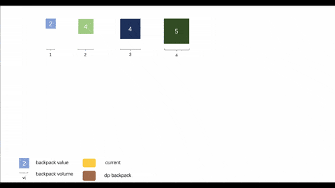
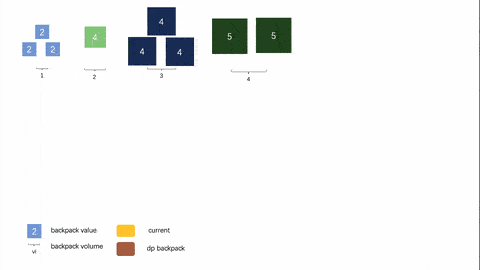

# Knapsack Problem
# 背包问题

|Title|Animation|Finish|
|--------|--------------------|:-:|
|[01背包问题](backpack_1/code.md)||&check;|
|[完全背包问题](backpack_2/code.md)||&check;|
|[多重背包问题](backpack_3/code.md)||&check;|
|[混合背包问题](backpack_4/code.md)||x|